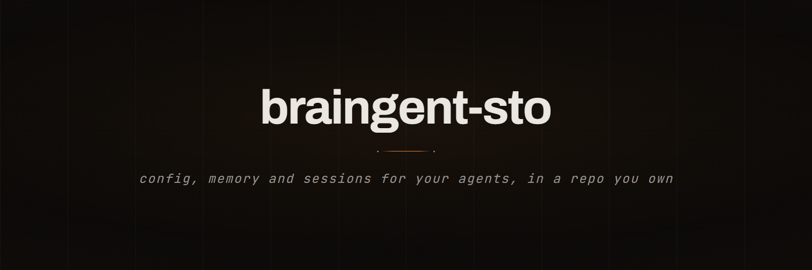

<p align="center">
  
</p>

<p align="center">
  
  
  
  
</p>

<p align="center">
  <a href="#why-it-exists"><b>Why it exists</b></a> &nbsp;•&nbsp;
  <a href="#features">Features</a> &nbsp;•&nbsp;
  <a href="#stack">Stack</a> &nbsp;•&nbsp;
  <a href="#structure">Structure</a> &nbsp;•&nbsp;
  <a href="#setup">Setup</a> &nbsp;•&nbsp;
  <a href="#commands">Commands</a>
</p>

braingent-sto turns a private git repository into the substrate that Claude Code is missing: your `~/.claude` config, your skills and plugins, the memories your agent writes, and the transcripts of every session, all synced between machines with two keystrokes. No daemon, no API key, no third-party service — a Python stdlib backend, `git`, and a terminal UI.

---

## Why it exists

Claude Code still has [no native way to sync config and skills across machines](https://github.com/anthropics/claude-code/issues/36693), and [no cloud sync for skills, settings and memory](https://github.com/anthropics/claude-code/issues/57678). The ecosystem answers with three separate families of tools:

| Need | Existing tools | What they leave out |
|---|---|---|
| Persistent memory | [claude-mem](https://github.com/thedotmack/claude-mem), [engram](https://github.com/Gentleman-Programming/engram), [agentmemory](https://github.com/rohitg00/agentmemory) | Config, skills and plugins stay on one machine; memory lives in a SQLite/vector store you can't read or diff |
| Config sync | [claude-sync](https://github.com/renefichtmueller/claude-sync), [claude-code-dotfiles](https://github.com/elizabethfuentes12/claude-code-dotfiles) | No sessions, no usage, no UI — sync and nothing else |
| Session browsing | [claude-code-log](https://github.com/daaain/claude-code-log), [claude-code-trace](https://github.com/delexw/claude-code-trace), [claude-history](https://github.com/raine/claude-history) | Local-only: what you did on the laptop is invisible from the desktop |

Claude Code's own auto memory is part of the same gap: it writes plain markdown into `~/.claude/projects/<repo>/memory/`, and [the docs are explicit](https://code.claude.com/docs/en/memory#storage-location) that those files "are not shared across machines or cloud environments".

STO is the union of the three, on one substrate. Every artifact is **plain text in your own repo** — memories are markdown with frontmatter, sessions are trimmed and redacted JSONL, config is the real files. You can read them, `grep` them, edit them by hand, and roll them back with `git revert`.

---

## Features

- **Built on the native memory, not beside it.** No second memory store, no protocol to paste into `CLAUDE.md`, nothing new to teach the model: Claude Code writes its auto memory as markdown, and STO mirrors those exact files between machines.
- **One repo, everything in it.** `sto push` exports sessions, memories, `~/.claude` modules and your vault, commits and pushes. `sto pull` applies them on the other machine — including installing missing plugins and marketplaces.
- **Modular sync.** Pick exactly which parts of `~/.claude` travel: `claude-md`, `settings`, `keybindings`, `skills`, `agents`, `hooks`, `plugins`. Memories, sessions and vault always travel.
- **Redaction on export.** Session transcripts are trimmed to what a reader needs (prompts, tool names, errors) and scrubbed of API-key-shaped strings before they ever hit a commit.
- **Terminal UI (`sto ui`).** Five tabs — Home, Sessions, Memory, Config, Help — over pure stdlib: `msvcrt` for keys, raw ANSI for pixels. No Ink, no `rich`, no dependencies. Alt screen, diff-based repaint, 2 KB of Python per frame.
- **Live push/pull progress.** Every step of a sync reports itself (`exporting sessions → staging → committing → pushing to origin`) with a spinner, instead of freezing the screen until git returns.
- **Memory graph.** A real graph of *your memories*: one node per memory, one per project, edges from `[[wikilinks]]`. Opens as a chrome-less window with a project/type/machine sidebar, click-to-inspect detail panel and search. Built from the same files the repo syncs, so it shows every machine and every session, not just this one.
- **Config parity at a glance.** The Home dashboard shows what is local-only, what is in the repo but not installed, and which plugins are missing on this machine.
- **Plan usage.** Live limit bars and the last days of token spend, straight from `ccusage` when it is installed.
- **Bilingual chrome.** English by default, Spanish one keystroke away — commands never change, only what they print.
- **Optional web app.** A React dashboard over the same backend, for when a terminal is not enough.

---

## Structure

```
braingent-sto/
├── scripts/
│   ├── sessions_server.py   # engine: sessions, memory, config sync, git — stdlib only
│   ├── cli.py               # `sto` — presentation over the engine
│   ├── ui.py                # the TUI: state + key → state, state → lines
│   ├── i18n.py              # every user-facing string, en/es
│   ├── memory_graph.html    # graph window template (canvas 2D, no CDN)
│   ├── dream_extract.py     # transcript parsing and redaction
│   ├── install_sto_cli.ps1  # installs the `sto` function into both PowerShell profiles
│   └── test_*.py            # the suite: no framework, no fixtures
├── app/                     # React + Vite dashboard (optional)
├── knowledge/               # what travels: sessions/, memory/, config/
├── vault/                   # curated knowledge: raw/ → wiki/ → outputs/
└── start.cmd                # double-click launcher: backend + app + `sto`
```

---

## Stack

- **Backend** — Python 3.11+, standard library only. No `pip install`, no virtualenv, no server to keep alive for the CLI: `cli.py` imports the engine directly.
- **Sync** — plain `git`. Your repo, your remote, your history. Conflicts are git conflicts, and you already know how to resolve those.
- **TUI** — `msvcrt` + ANSI escapes. Alternate screen buffer, per-line diffing, keyboard drain per frame.
- **Graph** — one HTML file, canvas 2D, hand-rolled force layout. Opens offline in a Chromium `--app` window.
- **App** — React 19, Vite 8, Tailwind 4, `react-force-graph` for the 2D/3D views.

---

## Setup

```bash
git clone https://github.com/SimonOcampo1/braingent-sto.git
cd braingent-sto
powershell -ExecutionPolicy Bypass -File scripts/install_sto_cli.ps1
```

Open a new terminal and you have `sto`. Now make the clone yours.

> **Every command below runs inside the `braingent-sto/` folder you just
> cloned.** The new GitHub repo is never cloned — you only need its URL.

1. Go to **github.com/new** and create an empty **private** repo, no README.
   Copy its URL.
2. The clone came from the public repo, so that one becomes `upstream`:
   ```bash
   git remote rename origin upstream
   ```
3. Your new repo becomes `origin` — the only remote that ever sees your knowledge:
   ```bash
   git remote add origin git@github.com:<you>/<your-repo>.git
   ```
4. Push the code to your repo, which also sets the branch to track it:
   ```bash
   git push -u origin main
   ```
5. Push your knowledge — `sto push` exports sessions, memories and the
   `~/.claude` modules you chose, commits and pushes them:
   ```bash
   sto push
   ```

Steps 4 and 5 are both in the same folder: the first publishes the engine, the
second publishes what the engine collected.

| remote | what lives there | who writes to it |
|---|---|---|
| `origin` | the engine **plus your sessions, memories and config** | only you, with `sto push` |
| `upstream` | the engine, nothing else | whoever publishes the OS |

### On every other machine

Here you *do* clone — and what you clone is **your private repo**, not the public one.

```bash
git clone git@github.com:<you>/<your-repo>.git
cd <your-repo>
powershell -ExecutionPolicy Bypass -File scripts/install_sto_cli.ps1
sto pull     # brings and installs what the other machines have
sto push     # uploads the memories this machine already had
```

That machine almost certainly has months of memories of its own already —
`sto push` picks them up on the first run, no setup, no import step. And
pulling first is safe: a pull never overwrites a local memory you have not
published yet.

From then on `sto push` / `sto pull` — or `p` / `l` inside `sto ui` — keep every
machine identical. The same instructions live in `sto ui` › Config, next to the
two remotes they are about.

### Getting updates to the OS itself

`sto update` merges `upstream` into your repo. If you skipped the rename above
it adds the remote itself, pointing at where the OS is published.

```
sto update            # what is available
sto update --apply    # bring it down   (or `u` inside `sto ui`)
```

Your memories cannot be overwritten by an update, and this is structural rather
than a promise: the published repo has never held a single file under
`knowledge/memory/`, so a merge has nothing to bring there.

If you made your repo by copying files instead of cloning or forking, the two
histories share no commit and git refuses to merge — the home says so. `sto
update --link` grafts them once, keeping every local file exactly as it is;
from then on `sto update` is an ordinary merge.

> Keep the repo **private**. It carries your session transcripts and memories.

Want the web app too? `start.cmd` installs the front-end dependencies, starts the backend and Vite, and opens the dashboard.

---

## Commands

| Command | What it does |
|---|---|
| `sto` / `sto status` | where sync stands: branch, ahead/behind, dirty |
| `sto push` / `sto pull` | export and upload / download and apply |
| `sto ui` | the terminal UI |
| `sto sessions [project]` | sessions, most recent first |
| `sto show <id>` | one transcript, through the pager |
| `sto search <text>` | full-text search across every session, every machine |
| `sto memory [project\|show\|search\|sync]` | the memories in the repo |
| `sto skills [id]` | installed skills, or one in full |
| `sto config` | which `~/.claude` modules are syncing |
| `sto machines` | the machines feeding the repo |
| `sto usage` | plan limits and recent spend |
| `sto graph [--memory\|--open\|<note>]` | memory graph window (read any memory in full), repo graph, or a node's neighbours |
| `sto update [--apply]` | bring OS updates down from upstream — never touches your knowledge |
| `sto badge [--install\|--off]` | the `◆ STO` badge in Claude Code's status line |

---

## What STO does not do

Honesty beats a feature matrix:

- **No embeddings, no semantic recall.** Search is lexical. If you want vector recall inside the agent loop, run [claude-mem](https://github.com/thedotmack/claude-mem) or [engram](https://github.com/Gentleman-Programming/engram) alongside it — they solve a different problem.
- **No MCP server.** The agent does not query STO at runtime; STO moves the files Claude Code already reads.
- **No memory system of its own.** Claude Code's auto memory writes the files; STO makes them travel. Nothing is distilled by a background job.
- **Windows-first.** The TUI needs `msvcrt` and the installer is PowerShell. The engine and CLI are portable; the terminal UI is not, yet.
- **Single user.** It syncs *your* machines. It is not a team knowledge base.

---

## What is next

The parking lot lives in [ROADMAP.md](ROADMAP.md): an MCP server so the agent can
query the repo mid-session, sync that reminds you (or runs itself), a
cross-platform TUI, and a few smaller things — each with the smallest sketch that
would do it.

## Tests

```bash
cd scripts
python test_sessions_server.py && python test_dream_extract.py && python test_cli.py && python test_ui.py
```

No framework, no fixtures, no mocks beyond swapping a function for a lambda. The TUI suite drives `handle()` and `draw()` directly, so it needs neither a terminal nor a pty.
